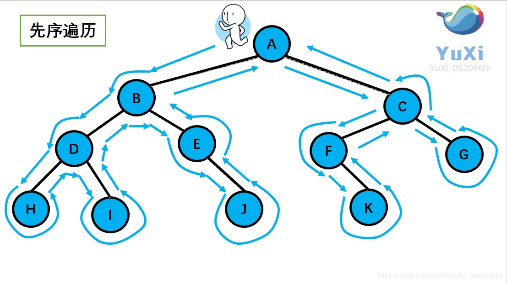
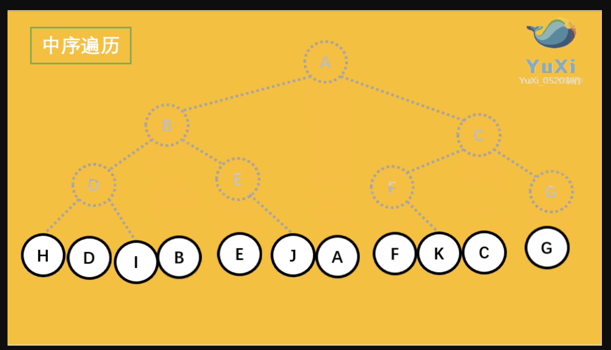
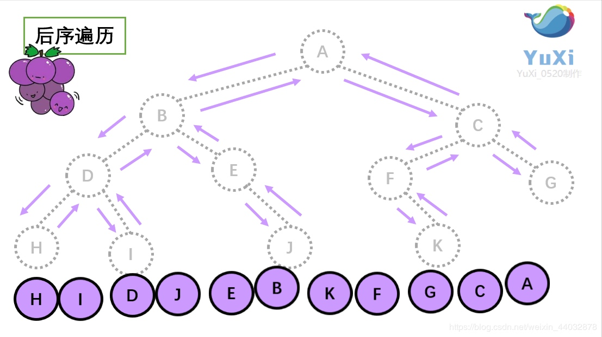
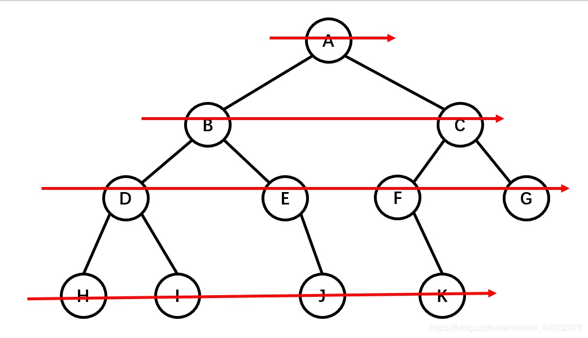

# 数据结构与算法 （一）
> 本文数据结构与算法的总结，本人间接性学习数据结构与算法大概2年的时间，一直没办法入门，参考李明杰老师的《恋上数据结构与算法》

## 一、复杂度
## 二、动态数组 ArrayList
### 1、数组
### 2、数组扩容
### 3、数组缩容
## 三、链表 LinkedList
### 1、链表的种类
#### 1、单向链表
#### 2、双向链表
#### 3、单向循环链表
#### 4、双向循环链表
### 2、练习题
#### 1、删除节点
#### 2、链表翻转
##### 1、递归
##### 2、迭代
#### 3、证明链表有环
##### 1、快慢指针
#### 4、计算环长
#### 5、移除链表元素
#### 6、删除排序链表中的重复元素
#### 7、链表的中间节点
### 3、数组与链表的速度对比
### 4、思考
#### 1、如何使用数组实现链表
## 四、栈
### 1、栈的特点
### 2、练习题
#### 1、有效括号
#### 2、括号的分数
#### 3、逆波兰表达式求值
#### 4、基本计算器

## 五、队列
### 1、队列的种类
#### 1、单端队列
#### 2、双端队列
#### 3、循环队列
#### 4、循环双端队列
### 2、练习题
#### 1、用栈实现队列
#### 2、用队列实现栈
## 六、二叉树
### 1、树的基本概念
- 1、节点、根节点、父节点、兄弟节点
- 2、一棵树可以没有任何节点，称为空树
- 3、一棵树可以只有一个节点，也就是根节点
- 4、子树、左子树、右子树
- 5、节点的度：子树的个数
- 6、数的度：所有节点度中的最大值
- 7、叶子节点：度为0的节点
- 8、非叶子节点：度不为0的节点
- 9、层数：根节点在第一层，根节点的子节点在第二层
- 10、节点的深度：从根节点到当前节点的唯一路径上的节点总数
- 11、节点的高度：从当前节点到最远叶子节点的路径上的节点总数
- 12、树的深度：所有节点深度中的最大值
- 13、树的高度：所有节点高度中的最大值
- 14、树的深度等于树的高度
### 2、有序树、无序树、森林
- 有序树：树的任意节点的子节点之间有顺序关系
- 无序树：树的任意节点的子节点之间没有顺序关系，也称自由树
- 森林：由m（m>=0）棵互不相交的树组成的集合
### 3、二叉树
#### 特点
- 每个节点的度最大为2（最多拥有2棵子树）
- 左子树和右子树是有序的
- 即使某节点只有一棵子树，也要区分左右子树
- 二叉树是有序树
- 非空二叉树的第i层最多有 2^(i-1)个节点
- 在高度为h的二叉树上最多有 2^h - 1个节点
- 对于任何非空二叉树，如果叶子节点的个数为n0，度为2的节点个数为n2，则有n0 = n2 + 1
    - 假设度为1的节点个数为n1，那么二叉树的节点总数n = n0 + n1 + n2
    - 二叉树的边数T = n1 + 2*n2 = n - 1 = n0 + n1 + n2 - 1
    - 因此 n0 = n2 + 1 
### 4、真二叉树
所有节点的度要么为0，要么为2
### 5、满二叉树
最后一层接节点的度都为0，其他节点的度都为2

在同样高度的二叉树中，满二叉树的叶子节点数量最多，总节点数最多

满二叉树一定是真二叉树，真二叉树不一定是满二叉树

### 6、完全二叉树
对节点从上到下，左至右开始编号，其所有编号都能与相同高度的满二叉树中的编号对应

叶子节点只会出现最后两层，最后一层的叶子节点都靠左对齐

完全二叉树从根节点至倒数第二层是一个满二叉树

满二叉树一定是完全二叉树，完全二叉树不一定是满二叉树

度为1的节点只有左子树

度为1的接电脑要么是1个，要么是0个

同样节点数量的二叉树，完全二叉树的高度最小

同样节点数量的二叉树，完全二叉树的高度最小

假设完全二叉树的高度为h（h>=1）,那么
 - 至少有 2^(h-1)个节点
 - 至多有 2^h - 1个节点
 - 总节点数为n
     - 2^(h-1) <= n <  2^h
     - h-1 <= log2n < h
     - h = floor(log2n) + 1
### 7、二叉树的遍历
#### 前序遍历
特点:根左右根左右

#### 中序遍历
动态图：https://i2.wp.com/img-blog.csdnimg.cn/20200429123443327.gif
特点:左根右左根右

其顺序正交投影，然后从左到右排序

#### 后序遍历
特点:左右根左右根
动态图 https://i2.wp.com/img-blog.csdnimg.cn/20200429123504470.gif

后序遍历就像是剪葡萄，我们要把一串葡萄剪成一颗一颗的。
还记得我们先序遍历绕圈的路线么？
就是围着树的外围绕一圈，如果发现一剪刀就能剪下的葡萄（必须是一颗葡萄），就把它剪下来，组成的就是后序遍历了

#### 层序遍历

### 8、四则运算
### 9、表达式树
### 10、练习题
- 1、完全二叉树节点数量与叶子节点数量的关系

## 七、二叉搜索树
## 八、AVL树
## 九、B树
## 十、红黑树
## 十一、集合
## 十二、映射
## 十三、哈希表
## 十四、二叉堆
## 十五、优先级队列
## 十六、哈夫曼树
## 十七、Trie树
## 十八、补充
