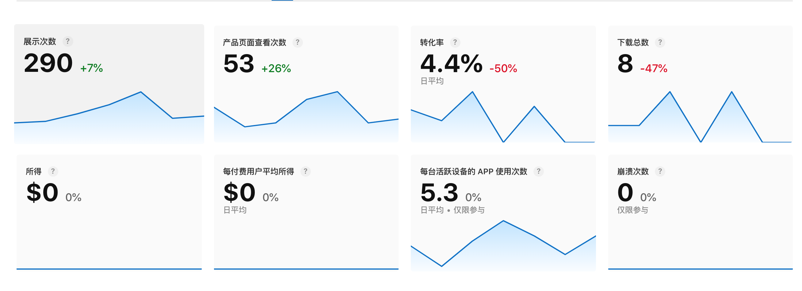

# 2.3 版本规划

## 一、目前数据如下：
1、最近7天内的次日留存为14.29
2、最近7天内的 DAU = 4
3、最近7天内的平均日使用时长为5分钟
4、最近7天平均新增为2

这是过去7天 appstore的截图

## 二、本期版本预计达成以下目的

1、appstore的展示数量 7天 达到500
    方式：优化关键字
2、产品页查看次数达到 7天 展示次数达到 100
    方式：优化appstore截屏
3、转化率 达到6%
    方式：优化appstore截屏、以及产品描述
4、新增次日留存 18%
    方式：增加提醒功能，然后app每天都有固定推送
5、界面优化美观简介

