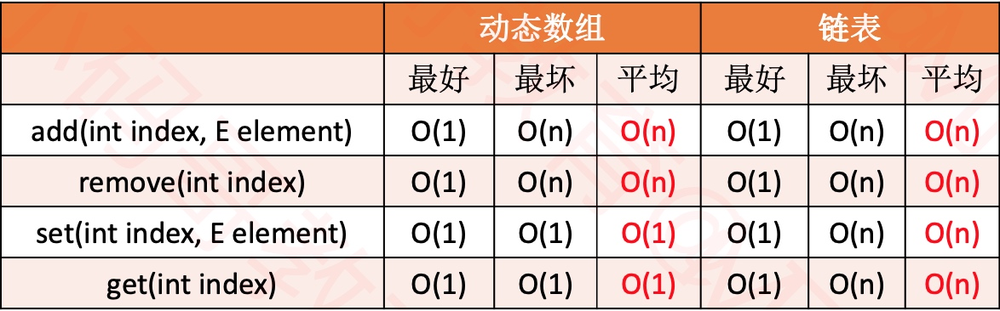
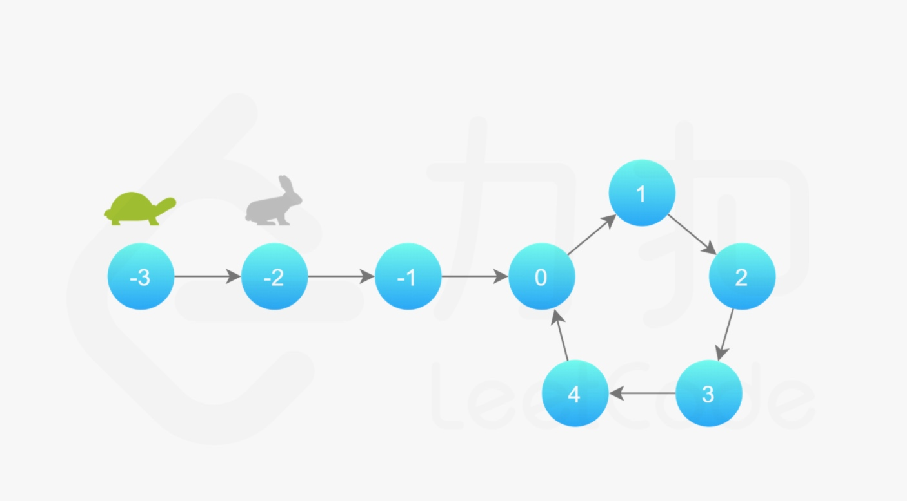

# Java 中的数据结构 链表

◼ 内存不连续 指针链接
◼ 链表的方法与数组基本相同
◼ ListNode 为链表中的节点
### LinkedList
◼ 双向链表

> 问题：LinkedList+与+ArrayList的区别？

◼ LinkedList 的内存是不连续的，每一个节点都包含三部分:value\last\next
◼ ArrayList 的内存是连续的




> 1、leetcode_206_反转链表

◼ 递归法
```
     public ListNode reverseList(ListNode head) {
        if (head == null || head.next == null){
            return head;
        }
        ListNode newHead = reverseList(head.next);
        head.next.next = head;
        head.next = null;
        return newHead;
     }
```
◼ 迭代法
```
     public ListNode reverseList(ListNode head) {
        if (head == null || head.next == null){
            return head;
        }
        ListNode now = head;
        ListNode pre = null;
        
        while (now != null){
            ListNode temp = now.next;
            now.next = pre;
            pre = now;
            now = temp;
        }
        return pre;
     }
```
> 2、leetcode_237_删除链表中的节点
```
public void deleteNode(ListNode node) {
	        node.val = node.next.val;
	        node.next = node.next.next;
}
```
> 3、leetcode_141_环形链表
```
public boolean hasCycle(ListNode head) {
	        if (head == null || head.next == null) {
	            return false;
	        }
	        ListNode slow = head;
	        ListNode fast = head.next;
	        while (slow != fast) {
	            if (fast == null || fast.next == null) {
	                return false;
	            }
	            slow = slow.next;
	            fast = fast.next.next;
	        }
	        return true;
	    }
```


快慢指针的注意点：开始时位置不同

> 4、leetcode_203_移除链表元素

◼ 递归法
```
public ListNode removeElements(ListNode head, int val) {
        if (head == null){
            return head;
        }
        ListNode temp = new ListNode();
        temp.next = head;
        ListNode curr = new ListNode();
        while (head.next != null){
            if (head.val == head.next.val){
                head.next = head.next.next
            }else{
                head = head.next;
        }
        return temp.next;
    }
```
◼ 迭代法
```
public ListNode removeElements(ListNode head, int val) {
        ListNode preHead = new ListNode(0);
        preHead.next = head;
        ListNode temp = preHead;
        while(temp.next != null) {
        	   if (temp.next.val == val) {
        		  temp.next = temp.next.next;
        	   }else {
        		  temp = temp.next;
        	   }
        }
        return preHead.next;
}
```
迭代法注意点：处理永远判断当前元素的下一个元素，如果判断当前节点的话，需要保留上一个元素。

> 5、leetcode_83_删除排序链表中的重复元素

◼ 递归法
```
public ListNode deleteDuplicates(ListNode head) {
        if (head == null || head.next == null){
            return head;
        }
        head.next = deleteDuplicates(head.next);
        if (head.val == head.next.val){
            return head.next;
        }else{
            return head;
        }
}
```
◼ 迭代法
```
public ListNode deleteDuplicates(ListNode head) {
        if (head == null){
            return head;
        }
        ListNode temp = new ListNode();
        temp.next = head;
        while (head.next != null){
            if (head.val == head.next.val){
                head.next = head.next.next;
            }else{
                head = head.next;
            }
        }
        return temp.next;
    }
```

> 6、leetcode_876_链表的中间结点
```
public ListNode middleNode(ListNode head) {
        if (head == null || head.next == null){
            return head;
        }
        ListNode fast = head.next;
        ListNode slow = head;

        while (fast != null){
            slow = slow.next;
            if (fast.next != null){
                fast = fast.next.next;
            }else{
                fast = null; 
            }            
        }
        return slow;
}
```